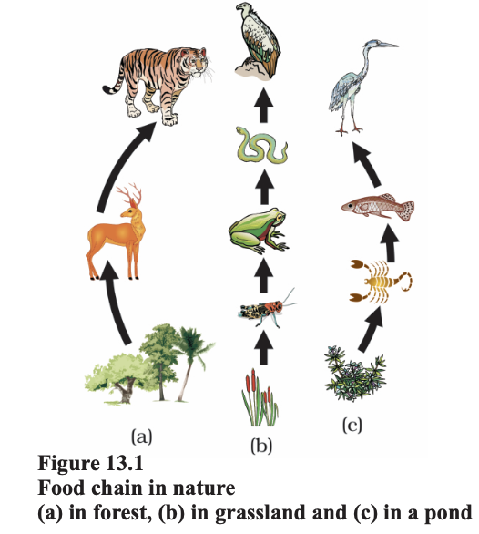
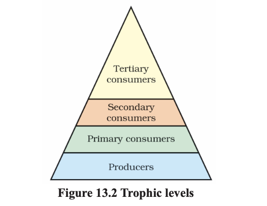
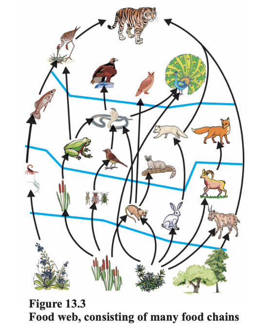
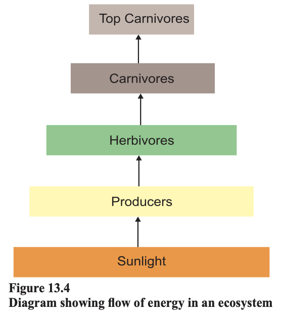

# 13.1 ECO-SYSTEM — WHAT ARE ITS COMPONENTS?

All organisms such as plants, animals, microorganisms and human beings as well as the physical surroundings interact with each other and maintain a balance in nature. All the interacting organisms in an area together with the non-living constituents of the environment form an ecosystem. Thus, an ecosystem consists of biotic components comprising living organisms and abiotic components comprising physical factors like temperature, rainfall, wind, soil and minerals.

For example, if you visit a garden you will find different plants, such as grasses, trees; flower bearing plants like rose, jasmine, sunflower; and animals like frogs, insects and birds. All these living organisms interact with each other and their growth, reproduction and other activities are affected by the abiotic components of ecosystem. So a garden is an ecosystem. Other types of ecosystems are forests, ponds and lakes. These are natural ecosystems while gardens and crop-fields are human-made (artificial) ecosystems.

We have seen in earlier classes that organisms can be grouped as producers, consumers and decomposers according to the manner in which they obtain their sustenance from the environment. Let us recall what we have learnt through the self sustaining ecosystem created by us above. Which organisms can make organic compounds like sugar and starch from inorganic substances using the radiant energy of the Sun in the presence of chlorophyll? All green plants and certain bacteria which can produce food by photosynthesis come under this category and are called the producers.

Organisms depend on the producers either directly or indirectly for their sustenance? These organisms which consume the food produced, either directly from producers or indirectly by feeding on other consumers are the consumers. Consumers can be classed variously as herbivores, carnivores, omnivores and parasites. Can you give examples for each of these categories of consumers?

Imagine the situation where you do not clean the aquarium and some fish and plants have died. Have you ever thought what happens when an organism dies? The microorganisms, comprising bacteria and fungi, break-down the dead remains and waste products of organisms. These microorganisms are the decomposers as they break-down the complex organic substances into simple inorganic substances that go into the soil and are used up once more by the plants. What will happen to the garbage, and dead animals and plants in their absence? Will the natural replenishment of the soil take place, even if decomposers are not there?

# 13.1.1 Food Chains and Webs

In Activity 13.2 we have formed a series of organisms feeding on one another. This series or organisms taking part at various biotic levels form a food chain (Fig. 13.1).

Each step or level of the food chain forms a trophic level. The autotrophs or the producers are at the first trophic level. They fix up the solar energy and make it available for heterotrophs or the consumers. The herbivores or the primary consumers come at the second, small carnivores or the secondary consumers at the third and larger carnivores or the tertiary consumers form the fourth trophic level (Fig. 13.2).

We know that the food we eat acts as a fuel to provide us energy to do work. Thus the interactions among various components of the environment involves flow of energy from one component of the system to another. As we have studied, the autotrophs capture the energy present in sunlight and convert it into chemical energy. This energy supports all the activities of the living world. From autotrophs, the energy goes to the heterotrophs and decomposers. However, as we saw in the previous Chapter on ‘Sources of Energy’, when one form of energy is changed to another, some energy is lost to the environment in forms which cannot be used again. The flow of energy between various components of the environment has been extensively studied and it has been found that – 

 

g The green plants in a terrestrial ecosystem capture about 1% of the energy of sunlight that falls on their leaves and convert it into food energy.  
g When green plants are eaten by primary consumers, a great deal of energy is lost as heat to the environment, some amount goes into digestion and in doing work and the rest goes towards growth and reproduction. An average of 10% of the food eaten is turned into its own body and made available for the next level of consumers.  
g Therefore, 10% can be taken as the average value for the amount of organic matter that is present at each step and reaches the next level of consumers.  
g Since so little energy is available for the next level of consumers, food chains generally consist of only three or four steps. The loss of energy at each step is so great that very little usable energy remains after four trophic levels.  
g There are generally a greater number of individuals at the lower trophic levels of an ecosystem, the greatest number is of the producers.  
g The length and complexity of food chains vary greatly. Each organism is generally eaten by two or more other kinds of organisms which in turn are eaten by several other organisms. So instead of a straight line food chain, the relationship can be shown as a series of branching lines called a food web (Fig. 13.3).

 

From the energy flow diagram (Fig. 13.4), two things become clear. Firstly, the flow of energy is unidirectional. The energy that is captured by the autotrophs does not revert back to the solar input and the energy which passes to the herbivores does not come back to autotrophs. As it moves progressively through the various trophic levels it is no longer available to the previous level. Secondly, the energy available at each trophic level gets diminished progressively due to loss of energy at each level.

Another interesting aspect of food chain is how unknowingly some harmful chemicals enter our bodies through the food chain. You have read in Class IX how water gets polluted. One of the reasons is the use of several pesticides and other chemicals to protect our crops from diseases and pests. These chemicals are either washed down into the soil or into the water bodies. From the soil, these are absorbed by the plants along with water and minerals, and from the water bodies these are taken up by aquatic plants and animals. This is one of the 

  

 

ways in which they enter the food chain. As these chemicals are not degradable, these get accumulated progressively at each trophic level. As human beings occupy the top level in any food chain, the maximum concentration of these chemicals get accumulated in our bodies. This phenomenon is known as biological magnification. This is the reason why our food grains such as wheat and rice, vegetables and fruits, and even meat, contain varying amounts of pesticide residues. They cannot always be removed by washing or other means.
# Questions 

1. What are trophic levels? Give an example
of a food chain and state the different
trophic levels in it.
2. What is the role of decomposers in the
ecosystem?