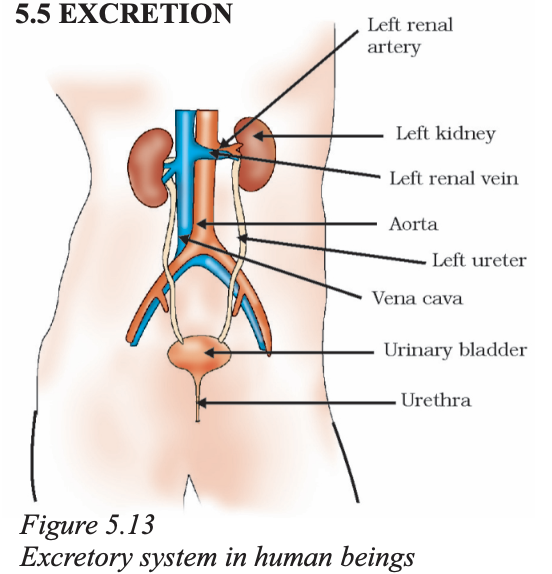
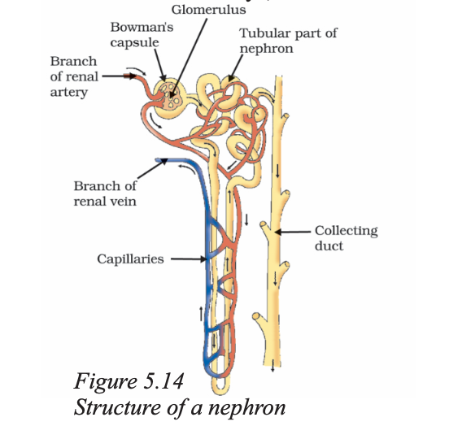

# Excretion

We have already discussed how organisms get rid of gaseous wastes generated during photosynthesis or respiration. Other metabolic activities generate nitrogenous materials which need to be removed. The biological process involved in the removal of these harmful metabolic wastes from the body is called excretion. Different organisms use varied strategies to do this. Many unicellular organisms remove these wastes by simple diffusion from the body surface into the surrounding water. As we have seen in other processes, complex multi-cellular organisms use specialised organs to perform the same function.

## 5.5.1 Excretion in Human Beings

The excretory system of human beings (Fig. 5.13) includes a pair of kidneys, a pair of ureters, a urinary bladder and a urethra. Kidneys are located in the abdomen, one on either side of the backbone. Urine produced in the kidneys passes through the ureters into the urinary bladder where it is stored until it is released through the urethra.

How is urine produced? The purpose of making urine is to filter out waste products from the blood. Just as CO₂ is removed from the blood in the lungs, nitrogenous waste such as urea or uric acid are removed from blood in the kidneys. It is then no surprise that the basic filtration unit in the kidneys, like in the lungs, is a cluster of very thin-walled blood capillaries. Each capillary cluster in the kidney is associated with the cup-shaped end of a coiled tube called Bowman’s capsule that collects the filtrate (Fig. 5.14). Each kidney has large numbers of these filtration units called nephrons packed close together. Some substances in the initial filtrate, such as glucose, amino acids, salts and a major amount of water, are selectively re-absorbed as the urine flows along the tube. The amount of water re-absorbed depends on how much excess water there is in the body, and on how much of dissolved waste there is to be excreted. The urine forming in each kidney eventually enters a long tube, the ureter, which connects the kidneys with the urinary bladder. Urine is stored in the urinary bladder until the pressure of the expanded bladder leads to the urge to pass it out through the urethra. The bladder is muscular, so it is under nervous control, as we have discussed elsewhere. As a result, we can usually control the urge to urinate.

## 5.5.2 Excretion in Plants

Plants use completely different strategies for excretion than those of animals. Oxygen itself can be thought of as a waste product generated during photosynthesis! We have discussed earlier how plants deal with oxygen as well as CO₂. They can get rid of excess water by transpiration. For other wastes, plants use the fact that many of their tissues consist of dead cells, and that they can even lose some parts such as leaves. Many plant waste products are stored in cellular vacuoles. Waste products may be stored in leaves that fall off. Other waste products are stored as resins and gums, especially in old xylem. Plants also excrete some waste substances into the soil around them.

## Questions

1. Describe the structure and functioning of nephrons.  
2. What are the methods used by plants to get rid of excretory products?  
3. How is the amount of urine produced regulated?