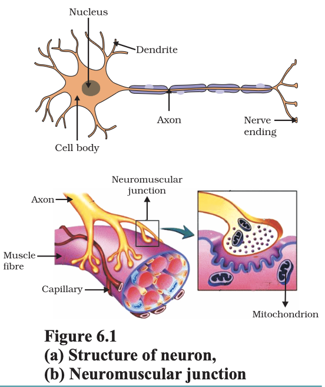
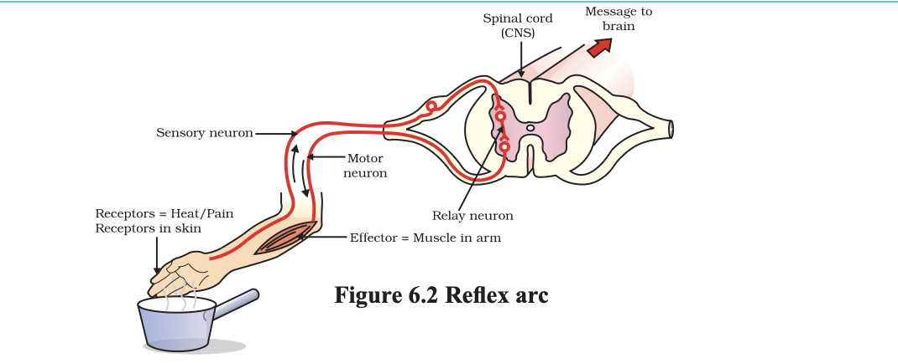
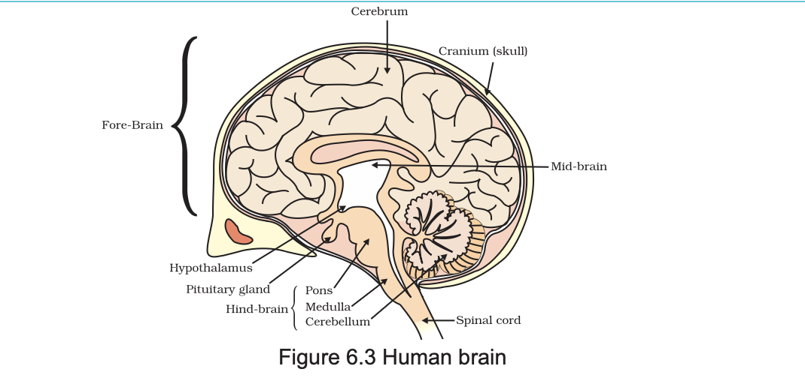

# 6.1 ANIMALS – NERVOUS SYSTEM

In animals, such control and coordination are provided by nervous and muscular tissues, which we have studied in Class IX. Touching a hot object is an urgent and dangerous situation for us. We need to detect it, and respond to it. How do we detect that we are touching a hot object? All information from our environment is detected by the specialised tips of some nerve cells. These receptors are usually located in our sense organs, such as the inner ear, the nose, the tongue, and so on. So gustatory receptors will detect taste while olfactory receptors will detect smell.

This information, acquired at the end of the dendritic tip of a nerve cell [Fig. 6.1 (a)], sets off a chemical reaction that creates an electrical impulse. This impulse travels from the dendrite to the cell body, and then along the axon to its end. At the end of the axon, the electrical impulse sets off the release of some chemicals. These chemicals cross the gap, or synapse, and start a similar electrical impulse in a dendrite of the next neuron. This is a general

scheme of how nervous impulses travel in the body. A similar synapse finally allows delivery of such impulses from neurons to other cells, such as muscles cells or gland [Fig. 6.1 (b)].

It is thus no surprise that nervous tissue is made up of an organised network of nerve cells or neurons, and is specialised for conducting information via electrical impulses from one part of the body to another.

Look at Fig. 6.1 (a) and identify the parts of a neuron:
1. where information is acquired,  
2. through which information travels as an electrical impulse, and  
3. where this impulse must be converted into a chemical signal for onward transmission.

---

Is there a difference in how sugar and food taste if your nose is blocked? If so, why might this be happening? Read and talk about possible explanations for these kinds of differences. Do you come across a similar situation when you have a cold?
# 6.1.1 What happens in Reflex Actions?

‘Reflex’ is a word we use very commonly when we talk about some sudden action in response to something in the environment. We say ‘I jumped out of the way of the bus reflexly’, or ‘I pulled my hand back from the flame reflexly’, or ‘I was so hungry my mouth started watering reflexly’. What exactly do we mean? A common idea in all such examples is that we do something without thinking about it, or without feeling in control of our reactions.

Yet these are situations where we are responding with some action to changes in our environment. How is control and coordination achieved in such situations?

Let us consider this further. Take one of our examples. Touching a flame is an urgent and dangerous situation for us, or in fact, for any animal! How would we respond to this?

One seemingly simple way is to think consciously about the pain and the possibility of getting burnt, and therefore move our hand. An important question then is, how long will it take us to think all this? The answer depends on how we think. If nerve impulses are sent around the way we have talked about earlier, then thinking is also likely to involve the creation of such impulses. Thinking is a complex activity, so it is bound to involve a complicated interaction of many nerve impulses from many neurons.

If this is the case, it is no surprise that the thinking tissue in our body consists of dense networks of intricately arranged neurons. It sits in the forward end of the skull, and receives signals from all over the body which it thinks about before responding to them. Obviously, in order to receive these signals, this thinking part of the brain in the skull must be connected to nerves coming from various parts of the body. Similarly, if this part of the brain is to instruct muscles to move, nerves must carry this signal back to different parts of the body. If all of this is to be done when we touch a hot object, it may take enough time for us to get burnt!

How does the design of the body solve this problem? Rather than having to think about the sensation of heat, if the nerves that detect heat were to be connected to the nerves that move muscles in a simpler way, the process of detecting the signal or the input and responding to it by an output action might be completed quickly. Such a connection is commonly called a reflex arc (Fig. 6.2). Where should such reflex arc connections be made between the input nerve and the output nerve? The best place, of course, would be at the point where they first meet each other. Nerves from all over the body meet in a bundle in the spinal cord on their way to the brain. Reflex arcs are formed in this spinal cord itself, although the information input also goes on to reach the brain.

Of course, reflex arcs have evolved in animals because the thinking process of the brain is not fast enough. In fact many animals have very little or none of the complex neuron network needed for thinking. So it is quite likely that reflex arcs have evolved as efficient ways of functioning in the absence of true thought processes. However, even after complex neuron networks have come into existence, reflex arcs continue to be more efficient for quick responses.

Can you now trace the sequence of events which occur when a bright light is focussed on your eyes?

# 6.1.2 Human Brain

Is reflex action the only function of the spinal cord? Obviously not, since we know that we are thinking beings. Spinal cord is made up of nerves which supply information to think about. Thinking involves more complex mechanisms and neural connections. These are concentrated in the brain, which is the main coordinating centre of the body. The brain and spinal cord constitute the central nervous system (Fig. 6.3). They receive information from all parts of the body and integrate it.

We also think about our actions. Writing, talking, moving a chair, clapping at the end of a programme are examples of voluntary actions which are based on deciding what to do next. So, the brain also has to send messages to muscles. This is the second way in which the nervous system communicates with the muscles. The communication between the central nervous system and the other parts of the body is facilitated by the peripheral nervous system consisting of cranial nerves arising from the brain and spinal nerves arising from the spinal cord. The brain thus allows us to think and take actions based on that thinking.

As you will expect, this is accomplished through a complex design, with different parts of the brain responsible for integrating different inputs and outputs. The brain has three such major parts or regions, namely the fore-brain, mid-brain and hind-brain.

The fore-brain is the main thinking part of the brain. It has regions which receive sensory impulses from various receptors. Separate areas of the fore-brain are specialised for hearing, smell, sight and so on. There are separate areas of association where this sensory information is interpreted by putting it together with information from other receptors as well as with information that is already stored in the brain. Based on all this, a decision is made about how to respond and the information is passed on to the motor areas which control the movement of voluntary muscles, for example, our leg muscles. However, certain sensations are distinct from seeing or hearing, for example, how do we know that we have eaten enough? The sensation of feeling full is because of a centre associated with hunger, which is in a separate part of the fore-brain.

Study the labelled diagram of the human brain. We have seen that the different parts have specific functions. Can we find out the function of each part?

Let us look at the other use of the word ‘reflex’ that we have talked about in the introduction. Our mouth waters when we see food we like without our meaning to. Our hearts beat without our thinking about it. In fact, we cannot control these actions easily by thinking about them even if we wanted to. Do we have to think about or remember to breathe or digest food? So, in between the simple reflex actions like change in the size of the pupil, and the thought out actions such as moving a chair, there is another set of muscle movements over which we do not have any thinking control.

Many of these involuntary actions are controlled by the mid-brain and hind-brain. All these involuntary actions including blood pressure, salivation and vomiting are controlled by the medulla in the hind-brain.

Think about activities like walking in a straight line, riding a bicycle, picking up a pencil. These are possible due to a part of the hind-brain called the cerebellum. It is responsible for precision of voluntary actions and maintaining the posture and balance of the body. Imagine what would happen if each of these events failed to take place if we were not thinking about it.

# 6.1.3 How are these Tissues protected?

A delicate organ like the brain, which is so important for a variety of activities, needs to be carefully protected. For this, the body is designed so that the brain sits inside a bony box. Inside the box, the brain is contained in a fluid-filled balloon which provides further shock absorption.

If you run your hand down the middle of your back, you will feel a hard, bumpy structure. This is the vertebral column or backbone which protects the spinal cord.

---

# 6.1.4 How does the Nervous Tissue cause Action?

So far, we have been talking about nervous tissue, and how it collects information, sends it around the body, processes information, makes decisions based on information, and conveys decisions to muscles for action. In other words, when the action or movement is to be performed, muscle tissue will do the final job.

How do animal muscles move? When a nerve impulse reaches the muscle, the muscle fibre must move. How does a muscle cell move? The simplest notion of movement at the cellular level is that muscle cells will move by changing their shape so that they shorten.

So the next question is, how do muscle cells change their shape? The answer must lie in the chemistry of cellular components. Muscle cells have special proteins that change both their shape and their arrangement in the cell in response to nervous electrical impulses. When this happens, new arrangements of these proteins give the muscle cells a shorter form.

Remember when we talked about muscle tissue in Class IX, there were different kinds of muscles, such as voluntary muscles and involuntary muscles. Based on what we have discussed so far, what do you think the differences between these would be?

# Questions

1. What is the difference between a reflex action and walking?

2. What happens at the synapse between two neurons?

3. Which part of the brain maintains posture and equilibrium of the body?

4. How do we detect the smell of an agarbatti (incense stick)?

5. What is the role of the brain in reflex action?