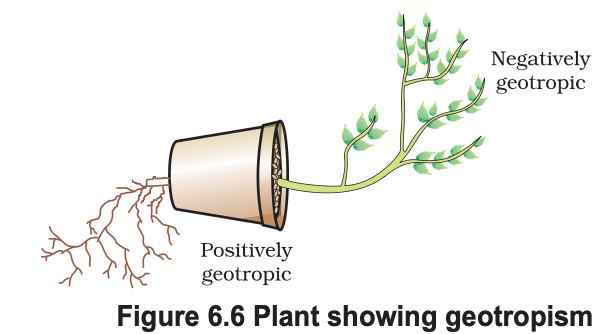

# 6.2 Coordination in Plants

Animals have a nervous system for controlling and coordinating body activities. However, plants do not have a nervous system or muscles. So, how do they respond to stimuli?

## Examples of Plant Responses

- When we touch the leaves of a **chhui-mui (sensitive plant / Mimosa)**, they fold up and droop.
- When a seed germinates:
  - The **root grows downward**
  - The **stem grows upward**

---

## Types of Movement in Plants

Plants show two types of movements:

### 1. Movement Independent of Growth
- Happens quickly
- Does not involve growth
- Example: Folding of leaves in the sensitive plant

### 2. Movement Dependent on Growth
- Happens slowly
- Caused by growth in specific directions
- Example: Directional growth of roots and stems

---

## 6.2.1 Immediate Response to Stimulus

Let us consider the movement of the sensitive plant.

- The leaves move quickly when touched
- No growth is involved in this movement

### How Does This Happen?

- The point where the plant is touched is different from where movement occurs
- This means **information must be communicated within the plant**

### Signal Transmission in Plants

- Plants use **electrical-chemical signals** to transmit information
- Unlike animals:
  - There is **no specialised nervous tissue**
  - Signals pass from cell to cell

### Movement Mechanism

- Some plant cells change shape to cause movement
- This happens due to:
  - Change in **water content** inside cells
  - Cells either **swell or shrink**
- This results in the folding or movement of leaves

---

## 6.2.2 Movement Due to Growth

Some plant movements occur due to growth.

### Example: Tendrils in Climbing Plants

- Plants like the **pea plant** use tendrils to climb
- Tendrils are sensitive to touch

### How Tendrils Work:

1. Tendril touches a support
2. The part touching the object grows slowly
3. The opposite side grows faster
4. This uneven growth causes the tendril to bend
5. The tendril coils around the support

---

## Directional Growth (Tropic Movement)

- Plants often respond to stimuli by growing in a specific direction
- This gives the appearance of movement

### Key Idea:
- Growth-based movement is **slow but directional**
- It helps plants adapt to their environment (light, gravity, support, etc.)

---

## Summary

- Plants respond to stimuli without a nervous system
- Movements can be:
  - **Immediate (non-growth based)**
  - **Growth-based (directional)**
- Communication happens through **chemical and electrical signals**
- Movement is achieved by **changes in cell shape or growth patterns**

# Tropic Movements and Hormonal Coordination in Plants

## Tropic Movements

Environmental triggers such as **light** and **gravity** influence the direction in which plant parts grow. These directional movements are called **tropic movements**.

### Types of Tropic Movements

Tropic movements can be:
- **Towards the stimulus** → Positive tropism  
- **Away from the stimulus** → Negative tropism  

### Phototropism (Response to Light)

- **Shoots** bend **towards light** (positive phototropism)
- **Roots** bend **away from light** (negative phototropism)

#### Importance:
- Helps plants maximize sunlight for **photosynthesis**

---

## Other Types of Tropism

### Geotropism (Response to Gravity)

- **Roots grow downward** → Positive geotropism  
- **Shoots grow upward** → Negative geotropism  

---

### Hydrotropism (Response to Water)

- Growth of plant parts (especially roots) **towards water sources**

---

### Chemotropism (Response to Chemicals)

- Growth of plant parts in response to chemical stimuli

#### Example:
- **Pollen tube grows towards ovule** during fertilization

---

## Speed of Movement in Plants vs Animals

- **Sensitive plant movement** → Very fast  
- **Sunflower movement (day/night)** → Slow  
- **Growth-related movement** → Very slow  

Even in animals:
- Some movements are fast (reflex actions)
- Some are slow (growth-related changes)

---

## Modes of Communication in Organisms

### 1. Electrical Communication (Animals)

- Fast transmission using **electrical impulses**
- Limitations:
  - Reaches only connected cells
  - Cannot be continuous (cells need recovery time)

---

### 2. Chemical Communication (Plants and Animals)

- Slower but more widespread
- Uses **chemical substances (hormones)**
- Can reach all cells
- Can act steadily over time

---

## Plant Hormones

Plants use **hormones** for coordination and response.

### Key Features:
- Produced at one location
- Travel (diffuse) to another location
- Regulate growth and responses

---

## Important Plant Hormones

### 1. Auxins
- Promote **cell elongation**
- Synthesized at the **shoot tip**

#### Role in Phototropism:
- Auxin moves to the **shaded side**
- Causes cells there to grow longer
- Leads to bending of the plant **towards light**

---

### 2. Gibberellins
- Promote **stem growth**

---

### 3. Cytokinins
- Promote **cell division**
- Found in high concentration in:
  - Fruits
  - Seeds

---

### 4. Abscisic Acid (ABA)
- **Inhibits growth**
- Causes:
  - Wilting of leaves
  - Growth suppression

---

## Summary

- Plants show **tropic movements** in response to environmental stimuli
- Growth direction is controlled by **hormones**
- Communication in plants occurs mainly through **chemical signals**
- Different hormones regulate:
  - Growth (Auxins, Gibberellins, Cytokinins)
  - Inhibition (Abscisic Acid)

# Questions 
1. What are plant hormones?
2. How is the movement of leaves of the
sensitive plant different from the
movement of a shoot towards light?
3. Give an example of a plant hormone that
promotes growth.
4. How do auxins promote the growth of a
tendril around a support?
5. Design an experiment to demonstrate
hydrotropism.
