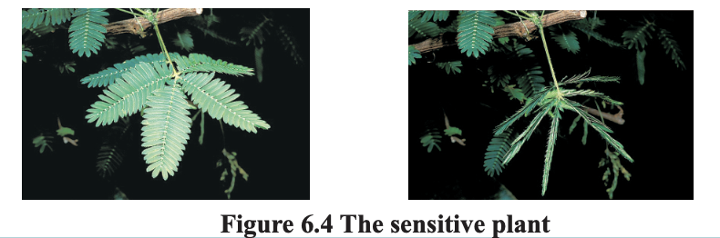
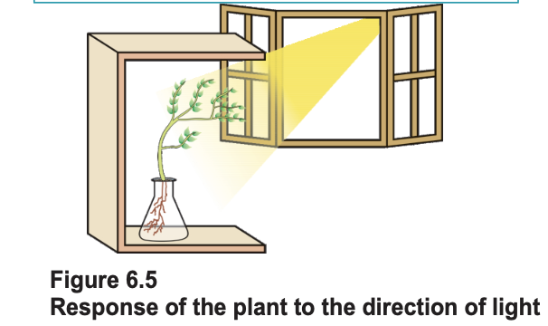

# 6.2 Coordination in Plants

Animals have a nervous system for controlling and coordinating the activities of the body. But plants have neither a nervous system nor muscles. So, how do they respond to stimuli?

When we touch the leaves of a chhui-mui (the ‘sensitive’ or ‘touch-me-not’ plant of the Mimosa family), they begin to fold up and droop. When a seed germinates, the root goes down, the stem comes up into the air. What happens?

Firstly, the leaves of the sensitive plant move very quickly in response to touch. There is no growth involved in this movement. On the other hand, the directional movement of a seedling is caused by growth. If it is prevented from growing, it will not show any movement.

So plants show two different types of movement – one dependent on growth and the other independent of growth.

# 6.2.1 Immediate Response to Stimulus

Let us think about the first kind of movement, such as that of the sensitive plant. Since no growth is involved, the plant must actually move its leaves in response to touch. But there is no nervous tissue, nor any muscle tissue. How does the plant detect the touch, and how do the leaves move in response?

If we think about where exactly the plant is touched, and what part of the plant actually moves, it is apparent that movement happens at a point different from the point of touch. So, information that a touch has occurred must be communicated. The plants also use electrical-chemical means to convey this information from cell to cell, but unlike in animals, there is no specialised tissue in plants for the conduction of information.

Finally, again as in animals, some cells must change shape in order for movement to happen. Instead of the specialised proteins found in animal muscle cells, plant cells change shape by changing the amount of water in them, resulting in swelling or shrinking, and therefore in changing shapes (Fig. 6.4).

# 6.2.2 Movement Due to Growth

Some plants like the pea plant climb up other plants or fences by means of tendrils. These tendrils are sensitive to touch. When they come in contact with any support, the part of the tendril in contact with the object does not grow as rapidly as the part of the tendril away from the object. This causes the tendril to circle around the object and thus cling to it. More commonly, plants respond to stimuli slowly by growing in a particular direction. Because this growth is directional, it appears as if the plant is moving. Let us understand this type of movement with the help of an example.

 
 

Environmental triggers such as light, or gravity will change the directions that plant parts grow in. These directional, or tropic, movements can be either towards the stimulus, or away from it. So, in two different kinds of phototropic movement, shoots respond by bending towards light while roots respond by bending away from it. How does this help the plant?

Plants show tropism in response to other stimuli as well. The roots of a plant always grow downwards while the shoots usually grow upwards and away from the earth. This upward and downward growth of shoots and roots, respectively, in response to the pull of earth or gravity is, obviously, geotropism (Fig. 6.6). If ‘hydro’ means water and ‘chemo’ refers to chemicals, what would ‘hydrotropism’ and ‘chemotropism’ mean? Can we think of examples of these kinds of directional growth movements? One example of chemotropism is the growth of pollen tubes towards ovules, about which we will learn more when we examine the reproductive processes of living organisms.

Let us now once again think about how information is communicated in the bodies of multicellular organisms. The movement of the sensitive plant in response to touch is very quick. The movement of sunflowers in response to day or night, on the other hand, is quite slow. Growth-related movement of plants will be even slower.

Even in animal bodies, there are carefully controlled directions to growth. Our arms and fingers grow in certain directions, not haphazardly. So controlled movements can be either slow or fast. If fast responses to stimuli are to be made, information transfer must happen very quickly. For this, the medium of transmission must be able to move rapidly.

Electrical impulses are an excellent means for this. But there are limitations to the use of electrical impulses. Firstly, they will reach only those cells that are connected by nervous tissue, not each and every cell in the animal body. Secondly, once an electrical impulse is generated in a cell and transmitted, the cell will take some time to reset its mechanisms before it can generate and transmit a new impulse. In other words, cells cannot continually create and transmit electrical impulses. It is thus no wonder that most multicellular organisms use another means of communication between cells, namely, chemical communication.

If, instead of generating an electrical impulse, stimulated cells release a chemical compound, this compound would diffuse all around the original cell. If other cells around have the means to detect this compound using special molecules on their surfaces, then they would be able to recognise information, and even transmit it. This will be slower, of course, but it can potentially reach all cells of the body, regardless of nervous connections, and it can be done steadily and persistently. These compounds, or hormones used by multicellular organisms for control and coordination show a great deal of diversity, as we would expect.

Different plant hormones help to coordinate growth, development and responses to the environment. They are synthesised at places away from where they act and simply diffuse to the area of action.

Let us take an example that we have worked with earlier [Activity 6.2]. When growing plants detect light, a hormone called auxin, synthesised at the shoot tip, helps the cells to grow longer. When light is coming from one side of the plant, auxin diffuses towards the shady side of the shoot. This concentration of auxin stimulates the cells to grow longer on the side of the shoot which is away from light. Thus, the plant appears to bend towards light.

Another example of plant hormones are gibberellins which, like auxins, help in the growth of the stem. Cytokinins promote cell division, and it is natural then that they are present in greater concentration in areas of rapid cell division, such as in fruits and seeds. These are examples of plant hormones that help in promoting growth. But plants also need signals to stop growing. Abscisic acid is one example of a hormone which inhibits growth. Its effects include wilting of leaves.

# Questions 
1. What are plant hormones?
2. How is the movement of leaves of the sensitive plant different from the movement of a shoot towards light?
3. Give an example of a plant hormone that promotes growth.
4. How do auxins promote the growth of a tendril around a support?
5. Design an experiment to demonstrate hydrotropism.
