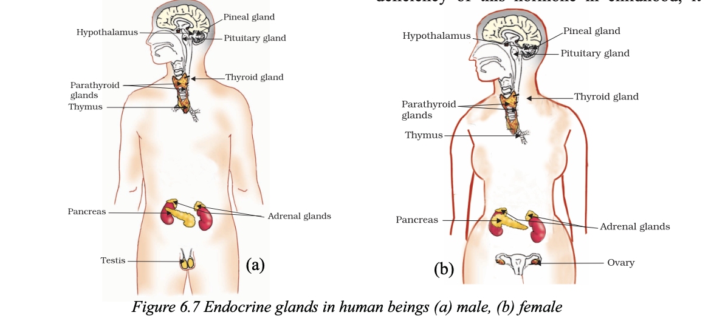

# 6.3 Hormones in Animals

## Hormonal Coordination in Animals

In animals, chemical signals (hormones) are used for communication and coordination in addition to the nervous system.

### Example: Response to a Scary Situation

When animals like squirrels face danger, their bodies prepare for:
- **Fighting**, or
- **Running away**

These activities:
- Require a lot of energy
- Involve coordination of multiple tissues
- Need rapid and widespread preparation in the body

---

## Role of Hormones vs Nervous Signals

- **Nervous signals (electrical impulses):**
  - Fast
  - Limited to connected cells

- **Hormonal signals (chemical):**
  - Slower
  - Reach **all parts of the body through blood**
  - Enable widespread coordination

---

## Adrenaline: The Emergency Hormone

The hormone **adrenaline** plays a key role in emergency situations.

### Source:
- Secreted by the **adrenal glands**

### Transport:
- Released directly into the **bloodstream**
- Reaches different parts of the body

---

## Effects of Adrenaline

Adrenaline prepares the body for action by causing the following changes:

### 1. Heart Activity
- Heart beats faster
- Increases oxygen supply to muscles

### 2. Blood Flow
- Blood supply to:
  - Digestive system
  - Skin → decreases
- Blood is redirected to:
  - Skeletal muscles

### 3. Breathing Rate
- Breathing becomes faster
- Due to contraction of:
  - Diaphragm
  - Rib muscles

---

### Result:
All these changes prepare the body to **deal with stress or danger effectively**.

---

## Endocrine System

- Hormones like adrenaline are part of the **endocrine system**
- This system provides another method of control and coordination in the body

---

## Role of Hormones in Growth

Unlike plants, animals do not show directional growth in response to stimuli like light or gravity.

However:
- Growth in animals is **carefully controlled**
- Body structure remains organized

### Example:
- Humans grow fingers on hands, not on the face
- Growth is regulated to maintain body design

---

## Example: Thyroxine Hormone

### Importance of Iodised Salt

- Iodine is essential for the production of **thyroxine hormone**
- Thyroxine is produced by the **thyroid gland**

### Functions of Thyroxine:
- Regulates metabolism of:
  - Carbohydrates
  - Proteins
  - Fats
- Ensures proper growth and development

---

## Iodine Deficiency and Goitre

- Lack of iodine in diet leads to reduced thyroxine production
- This can cause **goitre**

### Symptoms:
- Swelling in the neck

### Reason:
- Enlargement of the thyroid gland

---

## Key Takeaways

- Hormones provide **chemical coordination** in animals
- Adrenaline prepares the body for emergency situations
- The endocrine system works alongside the nervous system
- Hormones regulate growth and metabolism
- Iodine is essential for thyroid function and overall health

# Hormones in Animals – Growth, Puberty, and Feedback Mechanisms

## Growth Hormone and Body Development

Sometimes we see people who are:
- Very short (**dwarfs**)
- Extremely tall (**giants**)

This variation occurs due to the **growth hormone**, which is secreted by the **pituitary gland**.

### Functions of Growth Hormone:
- Regulates **growth and development** of the body

### Deficiency:
- Lack of growth hormone during childhood leads to **dwarfism**

---

## Hormones and Puberty

During the age of **10–12 years**, many physical and emotional changes occur. These changes are associated with **puberty**.

### Hormones Responsible:

- **Testosterone** (in males)
- **Oestrogen** (in females)

### Effects:
- Changes in physical appearance
- Development of secondary sexual characteristics

---

## Insulin and Blood Sugar Regulation

Some people are advised to reduce sugar intake due to **diabetes**.

### Role of Insulin:
- A hormone produced by the **pancreas**
- Regulates **blood sugar levels**

### If Insulin is Not Secreted Properly:
- Blood sugar levels rise
- Can cause harmful effects in the body

### Treatment:
- Insulin injections may be required

---

## Feedback Mechanism in Hormonal Control

Hormones must be secreted in **precise amounts** for proper functioning.

### How is this Controlled?

Through a **feedback mechanism**:

1. If blood sugar level rises:
   - Pancreas detects the increase
   - More insulin is released

2. As blood sugar level decreases:
   - Insulin secretion is reduced

---

## Key Takeaways

- Growth hormone controls body growth
- Sex hormones regulate changes during puberty
- Insulin maintains blood sugar balance
- Hormone secretion is controlled by feedback mechanisms

# Questions 
1. How does chemical coordination take
place in animals?
2. Why is the use of iodised salt advisable?
3. How does our body respond when
adrenaline is secreted into the blood?
4. Why are some patients of diabetes treated
by giving injections of insulin?