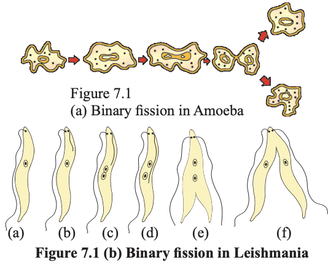
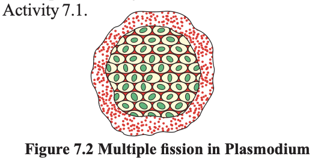
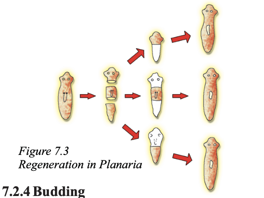
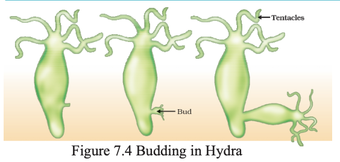
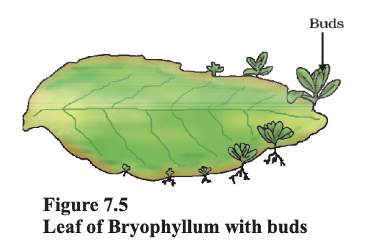
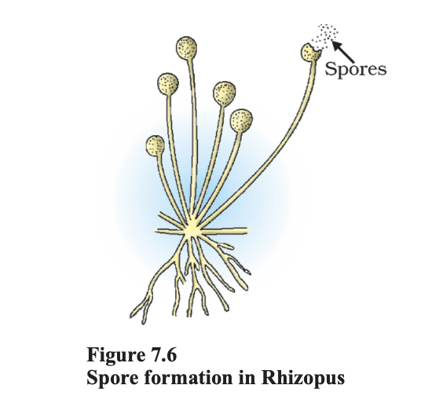

# 7.2 MODES OF REPRODUCTION USED BY SINGLE ORGANISMS 

## Comparing Yeast and Mould Growth

- **Yeast:**
  - Grows by **budding**
  - A small outgrowth (bud) forms on the parent cell
  - The bud grows and eventually separates

- **Mould:**
  - Grows by **spore formation**
  - Spores are produced in structures
  - Spores disperse and grow into new organisms

---

## Modes of Reproduction

The way organisms reproduce depends on their **body design**.

---

## 7.2.1 Fission

In **unicellular organisms**, reproduction occurs through **cell division**, also known as **fission**.

### Key Idea:
- One cell divides to form **new individuals**

---

## Types of Fission

### 1. Binary Fission

- The organism splits into **two equal halves**
- Common in:
  - Bacteria
  - Protozoa

---

### 2. Fission in Amoeba

- Division can occur in **any plane**
- Results in two daughter cells
- Each cell grows into a new organism

# Examples of Fission and Budding

## Binary Fission with Orientation

Some unicellular organisms show a higher level of organization.

### Example: Leishmania
- Causes **kala-azar**
- Has a **whip-like structure (flagellum)** at one end
- Binary fission occurs in a **definite orientation**
- Division is aligned with the body structure

---

## Multiple Fission

Some organisms divide into many cells at once.

### Example: Plasmodium
- Causes **malaria**
- Undergoes **multiple fission**
- One cell divides into **many daughter cells simultaneously**

---

## Budding

Some unicellular organisms reproduce differently.

### Example: Yeast
- Reproduces by **budding**
- A small **bud forms on the parent cell**
- The bud grows and separates
- The new organism continues to grow independently

# 7.2.2 Fragmentation

## Fragmentation in Simple Multicellular Organisms

In multicellular organisms with relatively simple body organization, simple reproductive methods can still work.

### Example: Spirogyra
- Reproduces by **fragmentation**
- The organism **breaks into smaller pieces (fragments)** upon maturation
- Each fragment grows into a **new individual**

---

## Why Fragmentation Works

- In simple organisms like Spirogyra:
  - Body structure is **not highly complex**
  - Cells are **similar and less specialized**
- Therefore:
  - Each fragment can grow independently into a complete organism

---

## Limitations in Complex Multicellular Organisms

Fragmentation does **not** occur in all multicellular organisms.

### Reason:

- Complex organisms have:
  - **Specialized cells**
  - Cells organized into **tissues**
  - Tissues organized into **organs**
  - Organs arranged in **specific positions**

In such cases:
- Simple breaking into pieces would not work
- Cell-by-cell division is **impractical**

---

## Need for Complex Reproductive Methods

Due to complex body organization:
- Multicellular organisms require **specialized reproductive processes**

---

## Specialized Cells for Reproduction

- Different cell types perform **different functions**
- Reproduction is carried out by a **specific type of cell**

### Key Idea:
- There must be a cell type that can:
  - **Grow**
  - **Divide (proliferate)**
  - **Differentiate into various cell types**

This enables the formation of a **complete organism** from a single cell.

# 7.2.3 Regeneration

## What is Regeneration?

Many fully differentiated organisms have the ability to form **new individuals from their body parts**.

- If the organism is cut or broken into pieces:
  - Some or many pieces can grow into **complete individuals**

---

## Examples

### Hydra
- Can be cut into several pieces
- Each piece grows into a **new organism**

### Planaria
- Can regenerate from **almost any body fragment**
- Each fragment develops into a **complete organism**

---

## Process of Regeneration

Regeneration occurs through the action of **specialised cells**.

### Steps Involved:

1. **Proliferation (Cell Division):**
   - Specialised cells divide rapidly
   - A large number of cells are formed

2. **Formation of Cell Mass:**
   - A group (mass) of cells is created

3. **Differentiation:**
   - Cells change into different types
   - Form tissues and structures

4. **Development:**
   - Organised sequence of changes
   - Leads to formation of a complete organism

---

## Important Note

- Regeneration is **not the same as reproduction**
- Most organisms:
  - Do not rely on being cut into pieces to reproduce

  

  # 7.2.4 Budding

## What is Budding?

Budding is a method of asexual reproduction in which a **new individual develops as an outgrowth (bud)** from the parent organism.

---

## Example: Hydra

- Hydra uses **regenerative cells** for reproduction
- A **bud forms on the parent body** at a specific site

---

## Process of Budding

1. **Cell Division:**
   - Repeated cell division occurs at one specific site

2. **Bud Formation:**
   - A small outgrowth (bud) develops

3. **Growth of Bud:**
   - The bud grows into a **tiny individual**

4. **Detachment:**
   - When fully mature, the bud:
     - Detaches from the parent
     - Becomes an **independent organism**

    

# 7.2.5 Vegetative Propagation

## What is Vegetative Propagation?

Vegetative propagation is a method of asexual reproduction in plants where **new plants develop from parts such as roots, stems, or leaves** under suitable conditions.

---

## Key Features

- Common in many plants
- Does not involve seeds
- New plants arise from **vegetative parts**

---

## Methods Used

Vegetative propagation is widely used in agriculture through methods such as:
- **Layering**
- **Grafting**

### Examples of Plants:
- Sugarcane  
- Roses  
- Grapes  

---

## Advantages

- Plants **flower and fruit earlier** than those grown from seeds
- Helps propagate plants that:
  - Have lost the ability to produce seeds  
  - Examples:
    - Banana  
    - Orange  
    - Rose  
    - Jasmine  

- Produces plants that are:
  - **Genetically similar (clones)** to the parent
  - Retain all desirable characteristics

---

## Example: Bryophyllum

- Buds are formed in the **notches along the leaf margins**
- These buds:
  - Fall onto the soil
  - Grow into **new plants**

# 7.2.6 Spore Formation

## Reproductive Structures in Simple Multicellular Organisms

In many simple multicellular organisms, **specific reproductive parts** can be identified.

### Example: Bread Mould (Rhizopus)

- The thread-like structures seen on bread are called **hyphae**
- Hyphae are **not reproductive parts**

---

## Sporangia and Spores

- The small **blob-like structures on stalks** are called **sporangia**
- Sporangia contain **spores**

### Features of Spores:
- Capable of developing into **new individuals**
- Have **thick protective walls**
- Can survive unfavorable conditions

---

## Germination of Spores

- Spores are released into the environment
- When they land on a **moist surface**:
  - They begin to grow
  - Develop into new organisms (e.g., Rhizopus)

---

## Asexual Reproduction

All the methods discussed so far:
- Fission
- Fragmentation
- Regeneration
- Budding
- Vegetative propagation
- Spore formation

These involve:
- Creation of new individuals from a **single parent**

### This type of reproduction is called:
> **Asexual Reproduction**

# Questions
1. How does binary fission differ from
multiple fission?
2. How will an organism be benefited if it
reproduces through spores?
3. Can you think of reasons why more
complex organisms cannot give rise to
new individuals through regeneration?
4. Why is vegetative propagation practised
for growing some types of plants?
5. Why is DNA copying an essential part of
the process of reproduction?