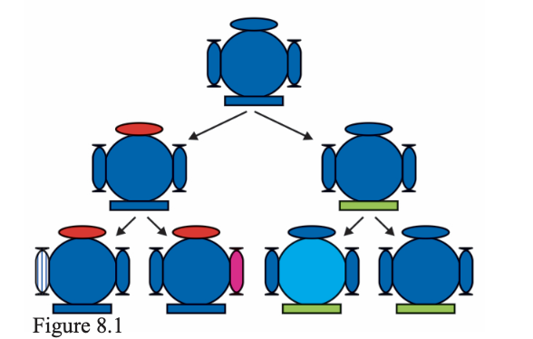

# 8.1 Accumulation of Variation During Reproduction

Inheritance from the previous generation provides:
- A **common basic body design**
- **Subtle variations** in the next generation

---

## Variation Across Generations

- When a generation reproduces:
  - Offspring inherit **differences from parents**
  - New variations are also **created**

- Over successive generations:
  - Variations **accumulate**
  - Individuals become **increasingly diverse**

---

## Asexual Reproduction and Variation

- In asexual reproduction:
  - A single organism reproduces
  - Example: **Bacteria**

### Process:
- One bacterium divides → 2 bacteria  
- These divide again → 4 bacteria  

### Result:
- All individuals are **very similar**
- Only **minor differences** occur due to:
  - Small inaccuracies in DNA copying

---

## Sexual Reproduction and Variation

- In sexual reproduction:
  - DNA from **two individuals combines**
- This leads to:
  - **Greater diversity**
  - More variation compared to asexual reproduction

---

## Survival of Variations

Not all variations are equally useful.

- Different individuals have **different advantages**
- Example:
  - Heat-resistant bacteria survive better in high temperatures

---

## Role of Environment

- The environment **selects useful variations**
- This process is called:
  - **Natural selection**

---

## Key Idea

- Accumulation of variations over generations
- Selection by environment
- Together form the basis of:
  > **Evolution**

# Questions 

1. If a trait A exists in 10% of a population of
an asexually reproducing species and a trait
B exists in 60% of the same population,
which trait is likely to have arisen earlier?
2. How does the creation of variations in a
species promote survival?