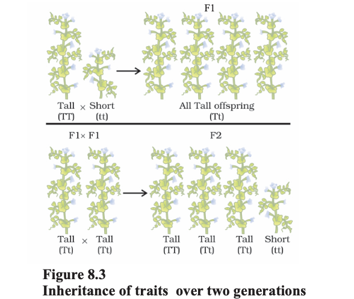
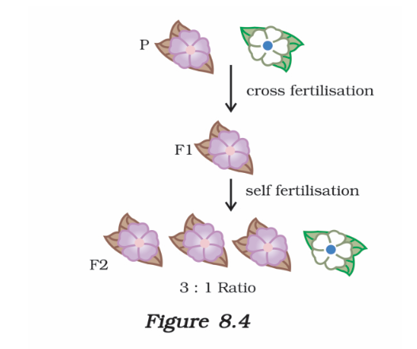
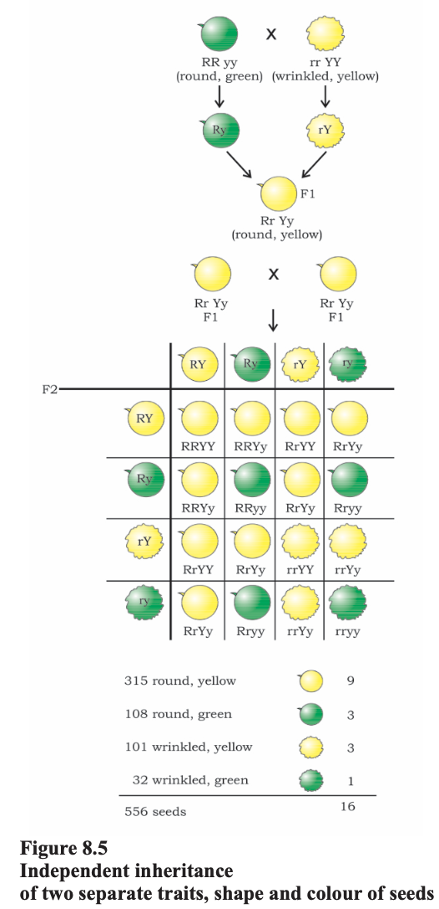
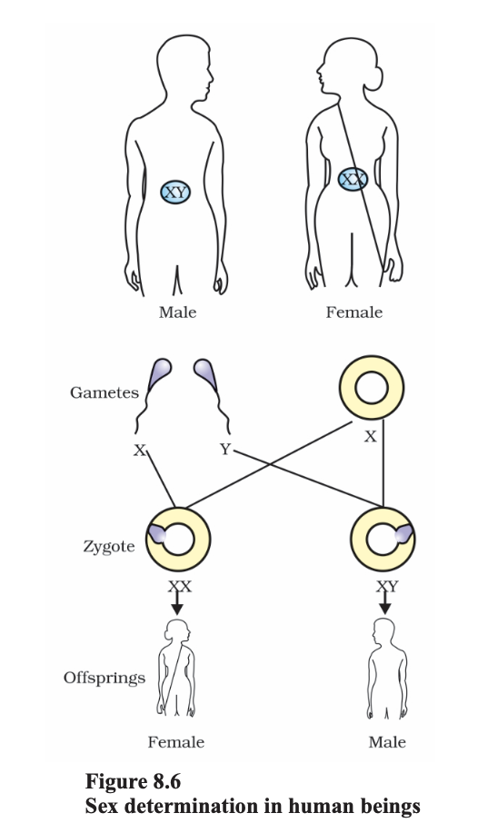

# 8.2 Heredity

The most obvious outcome of the reproductive process is the generation of individuals with **similar body design**.

- The rules of heredity determine how **traits and characteristics are inherited**
- These rules ensure that features are passed from **one generation to the next**

---

# 8.2.1 Inherited Traits

## Similarities and Differences

What do we mean by similarities and differences?

- A child:
  - Has all the **basic features of a human being**
  - But does **not look exactly like its parents**

- Human populations show a **great deal of variation**

# 8.2.2 Rules for the Inheritance of Traits – Mendel’s Contributions

## Basic Idea of Inheritance

- In humans:
  - Both **father and mother contribute equal genetic material**
- Therefore:
  - Each trait has **two versions (copies)** in an individual
  - One from each parent

---

## Mendel’s Experiments

Gregor Mendel studied inheritance using **garden pea plants**.

### Traits Studied:
- Round / Wrinkled seeds  
- Tall / Short plants  
- White / Violet flowers  

---

## Cross Between Tall and Short Plants

Mendel crossed:
- One **tall plant**
- One **short plant**

---

## First Generation (F₁ Generation)

- All offspring were **tall**
- No **intermediate (medium-height)** plants observed

### Conclusion:
- Only one parental trait is expressed
- Traits do not blend

---

## Second Generation (F₂ Generation)

- F₁ plants were allowed to **self-pollinate**

### Observations:
- Not all plants were tall
- About:
  - **3/4 tall plants**
  - **1/4 short plants**

---

## Key Inference

- Both **tall** and **short** traits were present in F₁ plants
- Only the **tall trait was expressed**

---

## Mendel’s Conclusion

- Traits are controlled by **factors (now called genes)**
- Each organism has:
  - **Two copies of each gene**
- These copies can be:
  - Identical, or
  - Different (one from each parent)

---

## Important Idea

- One trait can be **dominant** (expressed)
- The other can be **recessive** (hidden but present)

---

## Summary of Mendel’s Findings

- Traits are inherited in **pairs**
- One trait may **mask** the other
- Hidden traits can **reappear in later generations**

# Dominance, Dihybrid Cross, and Expression of Traits

## Dominant and Recessive Traits

- **TT** → Tall  
- **Tt** → Tall  
- **tt** → Short  

### Key Idea:
- A single **T** is enough to express tallness  
- Both copies must be **t** for shortness  

### Definitions:
- **Dominant Trait (T)** → Expressed even if one copy is present  
- **Recessive Trait (t)** → Expressed only when both copies are present  

---

## Dihybrid Cross (Two Traits)

### Parent Generation

Cross between:
- Tall plant with **round seeds**
- Short plant with **wrinkled seeds**

---

## First Generation (F₁)

- All offspring are:
  - **Tall**
  - **Round-seeded**

### Conclusion:
- Tallness and round seeds are **dominant traits**

---

## Second Generation (F₂)

After self-pollination of F₁ plants:

### Observed Types:
- Tall, round seeds  
- Short, wrinkled seeds  
- Tall, wrinkled seeds  
- Short, round seeds  

---

## Key Observation

- New combinations appear in F₂ generation
- Traits do not always stay together

### Conclusion:
- Traits are **independently inherited**

---

## Independent Assortment

- Traits such as:
  - Height (tall/short)
  - Seed shape (round/wrinkled)  
- Are inherited **independently of each other**

---

# 8.2.3 How do these Traits get Expressed?

## Role of DNA and Genes

- DNA is the **information source** for making proteins  
- A segment of DNA coding for one protein is called a **gene**

---

## How Genes Control Traits

### Example: Plant Height

- Growth depends on **plant hormones**
- Hormone production depends on **enzymes**

### Case 1:
- Efficient enzyme → more hormone → **tall plant**

### Case 2:
- Less efficient enzyme → less hormone → **short plant**

---

## Contribution from Parents

- Both parents contribute:
  - One copy of each gene  
- Therefore:
  - Each organism has **two copies of every gene**

---

## Role of Germ Cells

- Germ cells (gametes) contain:
  - **Only one set of genes**

### Reason:
- During fertilisation:
  - Two gametes combine
  - Restore the **normal gene number**

---

## Chromosomes and Inheritance

- Genes are located on **chromosomes**
- Chromosomes exist in **pairs**
  - One from mother  
  - One from father  

### During Germ Cell Formation:
- Each germ cell receives:
  - **One chromosome from each pair**
  - Can be of maternal or paternal origin

---

## Fertilisation

- Fusion of two germ cells:
  - Restores normal chromosome number
  - Maintains genetic stability of species

---

## Key Idea

- Traits are controlled by genes
- Genes are inherited through chromosomes
- Independent assortment explains Mendel’s results

# 8.2.4 Sex Determination

## Introduction

In sexual reproduction, the two sexes (male and female) are different.  
A key question is:

> How is the sex of a newborn determined?

---

## Sex Determination in Different Species

Different organisms use different methods:

### Environmental Determination
- In some reptiles:
  - **Temperature** of the environment determines sex

### Changeable Sex
- In some animals (e.g., snails):
  - Individuals can **change sex**
  - Sex is **not genetically fixed**

---

## Sex Determination in Humans

- In humans:
  - Sex is **genetically determined**
- The genes inherited from parents decide whether a child will be:
  - Male or Female

---

## Chromosomes in Humans

- Humans have:
  - **23 pairs of chromosomes**
    - 22 pairs → Normal (autosomes)
    - 1 pair → **Sex chromosomes**

---

## Sex Chromosomes

### In Females:
- **XX**
- Both chromosomes are the same

### In Males:
- **XY**
- One X chromosome and one shorter Y chromosome

---

## Key Idea

- Sex is determined by the **combination of sex chromosomes**
- Inheritance of X and Y chromosomes decides whether the individual is male or female

# Questions 
1. How do Mendel’s experiments show that
traits may be dominant or recessive?
2. How do Mendel’s experiments show that
traits are inherited independently?
3. A man with blood group A marries a
woman with blood group O and their
daughter has blood group O. Is this
information enough to tell you which of
the traits – blood group A or O – is
dominant? Why or why not?
4. How is the sex of the child determined in
human beings?