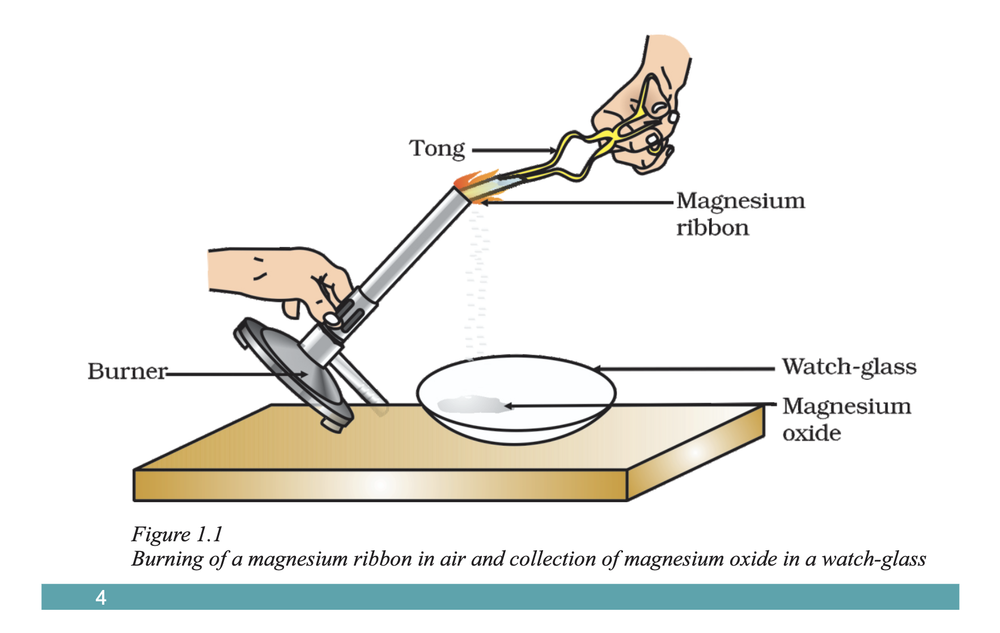
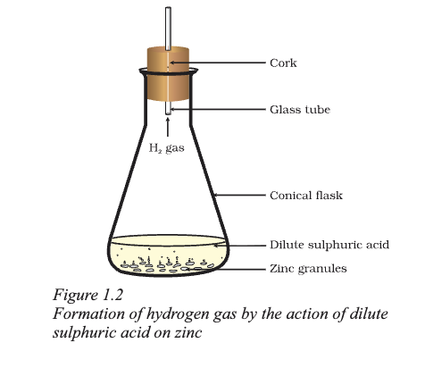

## Think and Observe

Think about what happens when:

- Milk is left at room temperature during summers  
- An iron tawa/pan/nail is left exposed to a humid atmosphere  
- Grapes get fermented  
- Food is cooked  
- Food gets digested in our body  
- We respire  

In all the above situations, the nature and identity of the initial substance have changed.  

We have already learnt about **physical and chemical changes** of matter in previous classes. Whenever a chemical change occurs, we can say that a **chemical reaction** has taken place.

You may wonder:

- What is a chemical reaction?  
- How do we know that a chemical reaction has occurred?  

Let us perform some activities to understand this.

---

## Activity 1.1

**CAUTION:** This activity requires teacher supervision. Students should wear suitable eye protection.

- Clean a magnesium ribbon (3–4 cm long) by rubbing it with sandpaper  
- Hold it with tongs  
- Burn it using a spirit lamp or burner  
- Collect the ash formed in a watch-glass  
- Keep it away from your eyes while burning  

**Observation:**  
Magnesium ribbon burns with a dazzling white flame and forms a white powder.

**Conclusion:**  
The white powder is **magnesium oxide**, formed by the reaction of magnesium with oxygen in the air.

---

## Activity 1.2

- Take lead nitrate solution in a test tube  
- Add potassium iodide solution  
- Observe the changes  

---

## Activity 1.3

**CAUTION:** Handle acids carefully.

- Take a few zinc granules in a test tube or conical flask  
- Add dilute hydrochloric acid or sulphuric acid  
- Observe what happens around the zinc granules  
- Touch the test tube/flask and note any temperature change  

**Observation:**  
Hydrogen gas is formed when zinc reacts with dilute sulphuric acid.

---

## Indicators of a Chemical Reaction

From the above activities, a chemical reaction can be identified by:

- Change in state  
- Change in colour  
- Evolution of a gas  
- Change in temperature  

---

As we observe the world around us, we see many chemical reactions occurring. In this chapter, we will study different types of chemical reactions and their symbolic representations.